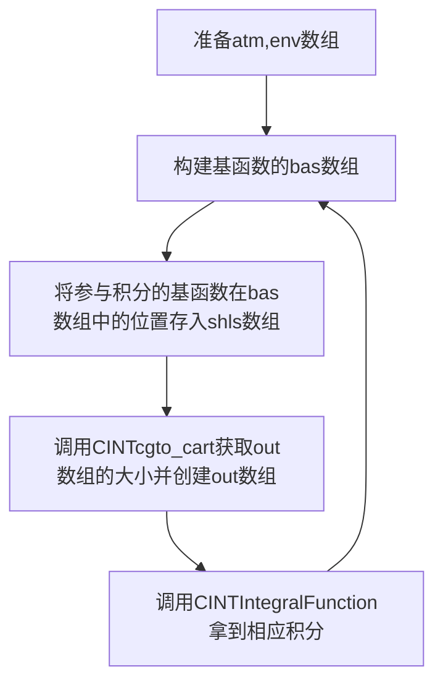
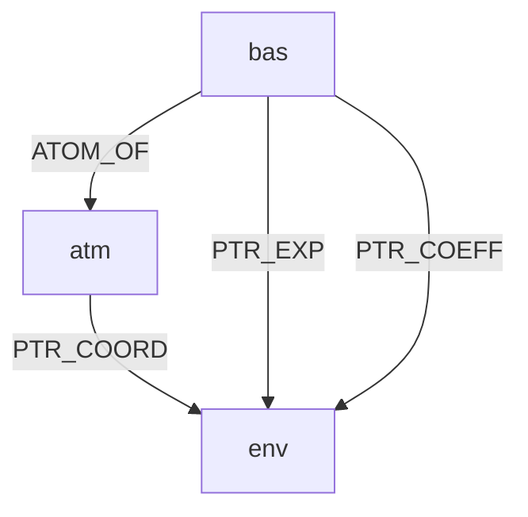
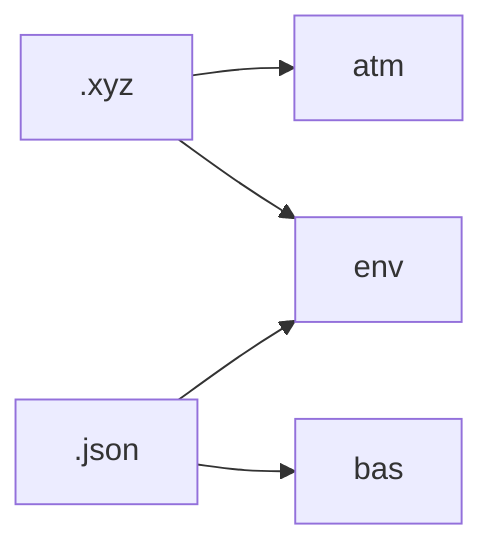

> ❗❗❗❗CAUTION❗❗❗❗
> 
> 本文主要内容是介绍cintjs中对libcint的封装思路，有少量介绍libcint的内容，但由于笔者水平有限，本文并不能完全当作是libcint的教程。
> 
> 因为libcint使用C语言编写，故本文的示例代码全使用C语言。

# 为libcint构建输入数据

- [为libcint构建输入数据](#为libcint构建输入数据)
  - [概述](#概述)
  - [积分函数](#积分函数)
    - [CINTIntegralFunction](#cintintegralfunction)
    - [函数与公式的对应关系](#函数与公式的对应关系)
  - [函数参数简介](#函数参数简介)
    - [shls](#shls)
    - [out](#out)
    - [atm](#atm)
    - [bas](#bas)
    - [env](#env)
  - [如何生成libcint需要的数据](#如何生成libcint需要的数据)
    - [概述](#概述-1)
    - [.xyz和.json间的解耦](#xyz和json间的解耦)
    - [libcint的封装](#libcint的封装)
    - [从AtomGroup到libcint](#从atomgroup到libcint)
    - [总结](#总结)

------------------------
------------------------

## 概述

libcint输入的数据之间耦合度极高，为了让Python调用，接口的定义也很非主流，再加上qiming写的文档和示例比较抽象，直接使用libcint有不小的难度。以下是使用libcint获取笛卡尔坐标系下电子积分的大致流程，



其中最麻烦的是各个数组中offset的准备。当然，如果只是尝试一下，可以先将env构建好并存下offset后再准备其他数组。bas数组也可以提前全部构建出来。

------------------------
------------------------

## 积分函数

------------------------

### CINTIntegralFunction

我们先看CINTIntegralFunction的调用形式，了解下我们需要准备哪些数据，以下是libcint中积分函数的通用形式，

```c
typedef CACHE_SIZE_T CINTIntegralFunction(double *out, FINT *dims, FINT *shls,
                                  FINT *atm, FINT natm, FINT *bas, FINT nbas, double *env,
                                  CINTOpt *opt, double *cache);
```

| 接口方向 |  形参   |   类型   | 数组 | 可选 |                作用                |
|:----:|:-----:|:------:|:--:|:---|:--------------------------------:|
|  O   |  out  | double | ✔  | ❌  |            获取函数输出的积分             |
|  I   | dims  |  int   | ✔  | ✔  |             out数组大小              |
|  I   | shls  |  int   | ✔  | ❌  |         指定哪些基函数参与积分，及其顺序         |
|  I   |  atm  |  int   | ✔  | ❌  |            储存原子核相关的信息             |
|  I   | natm  |  int   | ❌  | ❌  |           说明atm中有多少个原子           |
|  I   |  bas  |  int   | ✔  | ❌  |            储存基函数相关信息             |
|  I   | nbas  |  int   | ❌  | ❌  |          说明bas中有多少个基函数           |
|  I   |  env  | double | ✔  | ❌  |       储存原子坐标、基组参数，以及一些全局变量       |
|  I   |  opt  |  int   | ✔  | ✔  |              优化积分效率              |
|  I   | cache |  int   | ✔  | ✔  | 将一些数据放入其中，以便CPU把他们存在cache里提高计算速度 |

其中整型的位数一般来说是[32bits](https://en.cppreference.com/w/c/language/arithmetic_types)。

从上表中可以看到，需要准备shls、atm、bas、env四个数组输入，还需要准备out获取输出，后续会逐个进行介绍。

### 函数与公式的对应关系

libcint的doc已经几百年没更新了，有些函数没有写入doc中，需要去libcint中的include/cint_funcs.h文件搜索。函数用下划线划分为三部分，大多以"int1e"或"int2e"开头，前者表示单电子积分，后者表示双电子积分，另外还有"int3c1e"和"int3c2e"分别表示三中心单电子积分和三中心双电子积分。以"optimizer"结尾表示该函数用于生成这种积分的优化器，其他三者是在哪种坐标系下进行积分。

```
       intxxx_xxx_xxx
           │   │   │  optimizer
    int1e  │   │   │  cart
    int2e  │   │   └─ sph
  int3c1e ─┘   │      spinor
  int3c2e      │
            opertor
```

中间的算符可以在README.rst中查找，下表列出来了左矢和右矢中支持算符的别称及其数学符号，

|  别称   |                              算符                              |
|:-----:|:------------------------------------------------------------:|
|   p   |                         $-i \nabla$                          |
|  ip   |                           $\nabla$                           |
|  r0   |                     $\vec{r} - (0,0,0)$                      |
|  rc   |         $\vec{r} - \vec{R}_(env[PTR\_COMMON\_ORIG])$         |
|  ri   |                    $\vec{r} - \vec{R}_i$                     |
|  rj   |                    $\vec{r} - \vec{R}_j$                     |
|  rk   |                    $\vec{r} - \vec{R}_k$                     |
|  rl   |                    $\vec{r} - \vec{R}_l$                     |
|   r   |                        $ri/rj/rk/rl$                         |
|   g   | $\frac{i}{2} (\vec{R}_{bra} - \vec{R}_{ket}) \times \vec{r}$ |
| sigma |                      three pauli matrix                      |
|  dot  |                           $\cdot$                            |
| cross |                           $\times$                           |

以及支持的单电子算符和双电子算符，

|     别称     |                                                                                   算符                                                                                    |
|:----------:|:-----------------------------------------------------------------------------------------------------------------------------------------------------------------------:|
|    rinv    |                                                         $\frac{1}{ \vec{r} - \vec{R}_(env[PTR\_RINV\_ORIG]) }$                                                          |
|    nuc     |                                                              $\frac{\sum_N Z_N}{\|\vec{r} - \vec{R}_N\|}$                                                               |
| nabla-rinv |                                                    $\nabla (\frac{1}{\|\vec{r} - \vec{R}_(env[PTR\_RINV\_ORIG])\|})$                                                    |
|   gaunt    |                                                       $\frac{\alpha_i \cdot \alpha_j}{\|\vec{r}_i - \vec{r}_j\|}$                                                       |
|   breit    | $- \frac{1}{2} \frac{\alpha_i \cdot \alpha_j}{\|\vec{r}_i - \vec{r}_j\|} - \frac{1}{2} \frac{\alpha_i \cdot r_{ij} \alpha_j \cdot r_{ij}}{\|\vec{r}_i - \vec{r}_j\|^3}$ |

式中的env[PTR_COMMON_ORIG]是env数组中的一个参数，会在后续章节中介绍。

------------------------
------------------------

## 函数参数简介

------------------------

### shls

该数组储存的是参与积分的基函数的索引，比如bas中储存了一些基函数，我们想计算第一个和第四个的重叠积分，那么shls就可以写成（数组索引从0开始）

```c
shls = {0, 3};
```

想计算第一、二、四、五个基函数的eri，就写成

```c 
shls = {0, 1, 3, 4};
```

但计算eri的时候会涉及到基函数顺序的问题，如$(ij|kl)$显然是不等于$(il|kj)$的，shls中就必须写成

```c
shls = {i, j, k, l};    // (ij|kl)
shls = {i, l, k, j};    // (il|kj)
```

简单来说，就是shls中的基函数顺序与公式中的需要保持一致。当有些积分涉及到基函数作用了算符时就需要查看libcint中include/cint_funcs.h文件，每个函数的开头都有相应的注释，如动能积分

```c
/* <i|OVLP |P DOT P j> */
extern CINTOptimizerFunction int1e_kin_optimizer;
extern CINTIntegralFunction int1e_kin_cart;
extern CINTIntegralFunction int1e_kin_sph;
extern CINTIntegralFunction int1e_kin_spinor;
```

对应的数学公式是

$$
(i|\vec{p} \cdot \vec{p} \ j)
$$

调用时，shls需要写成

```c
shls = {i, j}
```

------------------------

### out

计算得到的out数组是个多维数组，其维度与shls的长度相同，但每个维度的长度需要通过调用函数获得。以STO为例，我们想计算bas中第i个基组和第j个基组在笛卡尔坐标系下的动能积分，也就是计算

$$
(i|\vec{p} \cdot \vec{p} \ j)
$$

那么计算得到out的维度就是2。如果基组$i$的角动量等于1，即基组$i$是个P型轨道，基组$j$的角动量等于2，即基组$j$是个D型轨道，各维度的长度如下

```c
int shls = {i, j};

int di = CINTcgto_cart(i, bas); // 3 p_x p_y p_z
int dj = CINTcgto_cart(j, bas); // 5 d_{xy} d_{xz} d_{yx} d_{x^2-y^2} d_{z^2}（并不一定是按该顺序排列，都记成j0,j1...就行了）
```

out数据的排布就是

|   0    |   1    |   2    |   3    |   4    |   5    |   6    | ... |
|:------:|:------:|:------:|:------:|:------:|:------:|:------:|:---:|
| i0, j0 | i0, j1 | i0, j2 | i0, j3 | i0, j4 | i1, j0 | i0, j1 | ... |

简单来讲，就是shls的长度就是out的维度（如果把out当作一个多维数组看）。输出的数据排布，从shls中最后的一个开始递增，比如上例中就从j开始增加，当增加到dj时j就归零，i加上1。

如果想将out转化为多维数组，需要注意所使用语言的数组储存是列优先还是行优先。[C语言是行优先](https://en.cppreference.com/w/c/language/array)
，因此可以将上例中的out数组声明为

```c
double out[di][dj];
```

对于其他的积分，可以参考如下，

```c
int shls_3c = {i, j, k};
double out_3c[di][dj][dk];

int shls_4c = {i, j, k, l};
double out_4c[di][dj][dk][dl];
```

注意，对于C语言，直接将out输入积分函数是不严谨的，编译器会出现警告甚至错误，对于如out[di][dj]，建议传入&out[0][0]。

这是因为out本质上指向的是out中第一个元素的指针。如果out是一个一维数组，那它指向的就是out[0]
，也就是一个double；但对于高维数组，比如out[di][dj]，out其实是指向out[0]这个指针数组的指针，或者说out指向的是一个数组而不是double。

但是，调用out[0][2]与调用(&out[0][0])[0 * di + 2]是等效的（dj > 2），这是因为out的数据在内存上的分布是连续的，拿到&out[0][0]
后就可以通过指针的偏移访问到其他全部元素。~~甚至segmentation fault~~

```c
double out[di][dj];
out[0][2] == (&out[0][0])[0 * di + 2]; // True
out[0][0] == out[0]; // error: invalid operands to binary == (have ‘double’ and ‘double *’)
```

------------------------

### atm

接下来正式进入输入数据的结构，先说一个相对简单的数组。atm中每六个元素表示一个原子的信息，以下两种定义方式在C语言中是等效的，

```c
/*
natm    总原子数
i       第i个原子
*/

/* 以下define已在cint.h中定义 */
#define CHARGE_OF       0
#define PTR_COORD       1
#define NUC_MOD_OF      2
#define PTR_ZETA        3
#define PTR_FRAC_CHARGE 4
#define RESERVE_ATMSLOT 5
#define ATM_SLOTS       6

/* 使用数组定义 */
int atm_array[natm*ATM_SLOTS];

atm_array[i * ATM_SLOTS + CHARGE_OF]          = ... ;
atm_array[i * ATM_SLOTS + PTR_COORD]          = ... ;
atm_array[i * ATM_SLOTS + NUC_MOD_OF]         = ... ;
atm_array[i * ATM_SLOTS + PTR_ZETA]           = ... ;
atm_array[i * ATM_SLOTS + PTR_FRAC_CHARGE]    = ... ;
atm_array[i * ATM_SLOTS + RESERVE_ATMSLOT]    = ... ;

/* 使用struct定义 */
struct{
    int CHARGE_OF      ;
    int PTR_COORD      ;
    int NUC_MOD_OF     ;
    int PTR_ZETA       ;
    int PTR_FRAC_CHARGE;
    int RESERVE_ATMSLOT;
} atm_struct[natm];

atm_struct[i].CHARGE_OF        = ... ;
atm_struct[i].PTR_COORD        = ... ;
atm_struct[i].NUC_MOD_OF       = ... ;
atm_struct[i].PTR_ZETA         = ... ;
atm_struct[i].PTR_FRAC_CHARGE  = ... ;
atm_struct[i].RESERVE_ATMSLOT  = ... ;

```

下表是各偏移量的含义

| 索引 |       名称        | 作用                  |
|:--:|:---------------:|:--------------------|
| 0  |    CHARGE_OF    | 原子电荷数               |
| 1  |    PTR_COORD    | 原子坐标在env中的位置（数组的索引） |
| 2  |   NUC_MOD_OF    |                     |
| 3  |    PTR_ZETA     |                     |
| 4  | PTR_FRAC_CHARGE |                     |
| 5  | RESERVE_ATMSLOT | 保留位                 |

------------------------

### bas

bas的定义与atm类似，bas中每八个元素表示一个基组的信息，以下两种定义方式在C语言中是等效的，

```c
/*
nbas    总原子数
i       第i个原子
*/

/* 以下define已在cint.h中定义 */
#define ATOM_OF         0
#define ANG_OF          1
#define NPRIM_OF        2
#define NCTR_OF         3
#define KAPPA_OF        4
#define PTR_EXP         5
#define PTR_COEFF       6
#define RESERVE_BASLOT  7
#define BAS_SLOTS       8

/* 使用数组定义 */
int bas_array[natom * ATM_SLOTS];
bas_array[i * BAS_SLOTS + ATOM_OF] = ... ;
bas_array[i * BAS_SLOTS + ANG_OF] = ... ;
bas_array[i * BAS_SLOTS + NPRIM_OF] = ... ;
bas_array[i * BAS_SLOTS + NCTR_OF] = ... ;
bas_array[i * BAS_SLOTS + KAPPA_OF] = ... ;
bas_array[i * BAS_SLOTS + PTR_EXP] = ... ;
bas_array[i * BAS_SLOTS + PTR_COEFF] = ... ;
bas_array[i * BAS_SLOTS + RESERVE_BASLOT] = ... ;

/* 使用struct定义 */
struct{
    int ATOM_OF;
    int ANG_OF;
    int NPRIM_OF;
    int NCTR_OF;
    int KAPPA_OF;
    int PTR_EXP;
    int PTR_COEFF;
    int RESERVE_BASLOT;
} bas_struct[n*BAS_SLOTS];

bas_struct.ATOM_OF = ... ;
bas_struct.ANG_OF = ... ;
bas_struct.NPRIM_OF = ... ;
bas_struct.NCTR_OF = ... ;
bas_struct.KAPPA_OF = ... ;
bas_struct.PTR_EXP = ... ;
bas_struct.PTR_COEFF = ... ;
bas_struct.RESERVE_BASLOT = ... ;

```

下表是各偏移量的含义

| 索引 |       名称       | 作用                               |
|:--:|:--------------:|:---------------------------------|
| 0  |    ATOM_OF     | 使用这个bas的原子在atm中的位置（第几个原子，不是数组索引） |
| 1  |     ANG_OF     | 基组的角动量                           |
| 2  |    NPRIM_OF    | PGTO的数量                          |
| 3  |    NCTR_OF     | CGTO的数量                          |
| 4  |    KAPPA_OF    |                                  |
| 5  |    PTR_EXP     | PGTO指数在env中的位置（数组索引）             |
| 6  |   PTR_COEFF    | CGTO指数在env中的位置（数组索引）             |
| 7  | RESERVE_BASLOT | 保留位                              |

------------------------

### env

env中储存了原子坐标、基组参数，以及一些全局变量。除前二十个元素有固定位置外，其他元素比较随意，只需要将某个数据的所有元素放在一起就行，比如某个原子的x,y,z坐标就必须放在一起，某个基组PGTO的系数必须放在一起，但CGTO的系数和PGTO的系数并不一定要放在一起。笔者建议用以下格式组织env，

```
┌[env] = 0
├─┬[global_parameters] = 0
│ ├──[PTR_EXPCUTOFF] = 0      // 积分prescreening的阈值，等于ln(threshold)，具体参考direct相关方法
│ ├──[PTR_COMMON_ORIG] = 1    // 积分的参考点，参考“函数与公式的对应关系”中的算符定义
│ ├──[PTR_RINV_ORIG] = 4      // $\frac{1}{\|r-R_O\|}$中的$R_O$
│ ├──[PTR_RINV_ZETA] = 7
│ ├──[PTR_RANGE_OMEGA] = 8      
│ ├──[PTR_F12_ZETA] = 9
│ ├──[PTR_GTG_ZETA] = 10
│ ├──[NGRIDS] = 11
│ └──[PTR_GRIDS] = 12
├─┬[atoms_coordinates] = 20
│ ├──[coordinates_0] = 0                            <= atm(PTR_COORD, 0)
│ ├──[zeta_0] = 3                                   <= atm(PTR_ZETA, 0)
│ ├── ...
│ ├──[coordinates_i] = i * 4                        <= atm(PTR_COORD, i)
│ ├──[zeta_i] = i * 4 + 3                           <= atm(PTR_ZETA, i)
│ ├── ...
│ ├──[coordinates_n] = (n - 1) * 4                  <= atm(PTR_COORD, n)
│ └──[zeta_n] = (n - 1) * 4 + 3                     <= atm(PTR_ZETA, n)
├─┬[basis_parameters] = 20 + n * 3 
│ ├─┬[basis_0] = 0
│ │ ├──[exponents] = 0 * bas(NPRIM_OF, 0)           <= bas(PTR_EXP, 0)
│ │ ├──[coefficients_1] = 1 * bas(NPRIM_OF, 0)      <= bas(PTR_COEFF, 0)
│ │ ├── ...
│ │ ├──[coefficients_i] = i * bas(NPRIM_OF, 0) 
│ │ ├── ...
│ │ └──[coefficients_n] = n * bas(NPRIM_OF, 0) 
│ ├──[basis_1] = (bas(NCTR_OF, 1) + 1) * bas(NPRIM_OF, 1)
│ ├── ...
│ ├─┬[basis_i] = \sum_{j=0}^{i-1} (bas(NCTR_OF, j) + 1) * bas(NPRIM_OF, j)
│ │ ├──[exponents] = 0 * bas(NPRIM_OF, i)           <= bas(PTR_EXP, i)
│ │ ├──[coefficients_1] = 1 * bas(NPRIM_OF, i)      <= bas(PTR_COEFF, i)
│ │ ├── ...
│ │ ├──[coefficients_i]  = i * bas(NPRIM_OF, i)
│ │ ├── ...
│ │ └──[coefficients_n] = n * bas(NPRIM_OF, i)
│ ├── ...
│ └─┬[basis_n] = \sum_{j=0}^{n-1} (bas(NCTR_OF, j) + 1) * bas(NPRIM_OF, j)
│   └── ...
└──┬[other_data] = \sum_{j=0}^{n} (bas(NCTR_OF, j) + 1) * bas(NPRIM_OF, j)
   └── ...
```

我们把每个横线都称为一个节点，用方括号括起来的文字用于说明该节点的作用，其等号后的数值是该节点相对于父节点的偏移量，箭头表示bas或atm里的哪个元素等于该节点的偏移量，该节点偏移量与下个节点偏移量的差就是该节点的长度。

如coordinates_i，代表第i个原子的坐标，其偏移量等于$0+20+i*3$，由于atoms_coordinates每个节点的长度都是3，因此$env[0+20+i*3+0]
,env[0+20+i*3+1],env[0+20+i*3+2]$都是coordinates_i的元素。

全局变量的定义及其作用可以在cint.h中查询，不使用全局变量的时候建议全置0。

------------------------
------------------------

## 如何生成libcint需要的数据

------------------------

### 概述

从上面atm, bas, env的定义中可以发现，三者有如下关系，



可以看到atm、bas、env三者耦合到了一起，并且由于env中数据种类繁杂，基组的长度不定，因此三者的耦合度比较高。

作为一名程序员，我们肯定希望输入、转换、调用越简单越好，可拓展性越高越好。因此，需要将三个数组解耦。以下内容将讨论如何从".xyz"和".json"转换到atm, bas, env（".json"文件指代从[BSE](https://www.basissetexchange.org/)上下载的基组文件，".xyz"文件参考[谈谈记录化学体系结构的xyz文件](http://sobereva.com/477)）。



### .xyz和.json间的解耦

从原始数据到输入数组不能直接转换，必须使用一个临时的数据结构。这是因为，".xyz"中的坐标储存在env中，但元素的信息却储存在atm中，在没有将所有数据读入时，env的大小无法确定，也就无法申请一块空间储存坐标了，bas也是一样。

考虑到很多情况下原子除坐标外的信息一般不会变动（比如烷烃里碳的参数），以及某一类原子的基组是完全相同的（比如烷烃里碳的基组）。因此我们从libcint的输入数据倒推。可以把atm数组中的PTR_COORD去掉，将其替换成多个原子坐标的数组。同理，bas中的ATOM_OF也可以去掉。以下是C语言的示例，

```c
typedef struct{
    int NPRIM_OF;
    int NCTR_OF;
    int KAPPA_OF;
    int PTR_EXP;
    int PTR_COEFF;

    int* angular_momentum;  // 数组
    double* exponents;      // 数组
    double* coefficients;   // 数组
} JsonBasis;

typedef struct{
    int CHARGE_OF;
    int NUC_MOD_OF;

    int natom;
    int nbasis;

    double* zeta;           // 数组
    double* frac_charge;    // 数组
    double* coordinates;    // 数组

    JsonBasis* basis[];     // 指针数组
} AtomGroup;
```

也就是将原子分组，一组原子共用除坐标外的所有信息。当".json"基组文件解析完成后，就可以直接把所有信息一股脑地全扔到JsonBasis中。然后再解析".xyz"原子坐标文件，把坐标扔到一个数组后，将basis的元素指向先前创建好的JsonBasis，就完成了输入文件的读取。后续再通过AtomGroup和JsonBasis创建libcint需要的数组。

> 思考：为什么AtomGroup中的basis是指针数组而不是数组？

### libcint的封装

在考虑如何生成输入数组前，我们先来思考一下最后应该怎样调用libcint。

按照qiming的示例以及libcint的接口，需要指定哪个基函数参与积分。如果只是简单的调用，我们可以把所有bas生成出来，就算有10,000个基函数也只需要$10,000 * 8 * 4 / 1024 = 312.5\mathrm{KB}$内存。但本着能省则省的原则，以及考虑到未来需要按原子组织积分的情况（如计算能量的梯度），建议通过指定原子的索引和该原子某一基函数的索引来调用。

如STO中O原子有$1S$、$2S$、$2P$三个基函数，在获取氧分子的重叠积分时，可以按以下方式调用，

```c
cint_overlap({0, 0}, {1, 0}, cint); // 第一个氧原子的1S与第二个氧原子的1S
cint_overlap({0, 0}, {1, 1}, cint); // 第一个氧原子的1S与第二个氧原子的2S
cint_overlap({0, 0}, {1, 2}, cint); // 第一个氧原子的1S与第二个氧原子的2P
```

基函数的指定由一个长度为2的数组完成，该数组第一个元素是原子在atm中的索引，第二个元素是基函数在AtomGroup.basis中的索引，也就是说明是该原子的哪一个基函数。cint中包含积分需要的所有信息，在这里不谈其具体实现。

### 从AtomGroup到libcint

一般来说原子的数量并不多，因此atm可以提前生成好。env里的数据一般也不会变动（除全局变量），故也可以提前生成。

在读入外部数据的时候，我们就知道了总原子数以及基函数数量，因此就知道了env的长度，可以把env申明出来。然后分别遍历所有AtomGroup和JsonBasis将[env](#env)中提到数据全部放入。在遍历AtomGroup时，也可以把atm顺便生成出来。

> 思考：为什么是分别遍历AtomGroup和JsonBasis？

但这里有一个问题，把JsonBasis的信息全部放入env后，我们没有记录数据的偏移量（bas中PTR_EXP和PTR_COEFF），所以还得创建一个TemplateBasis来储存bas相关信息，

```c
typedef struct{
    int ATOM_OF;
    int ANG_OF;
    int NPRIM_OF;
    int NCTR_OF;
    int KAPPA_OF;
    int PTR_EXP;
    int PTR_COEFF;
    int RESERVE_BASLOT;
} TemplateBasis;
```

细心的读者会发现TemplateBasis的定义和Basis完全一样，但TemplateBasis中的ATOM_OF并不需要指明，在生成Basis时再重新赋值即可。

TemplateBasis在遍历JsonBasis时就创建，同一元素的基组放在一个数组内，最后再把所有TemplateBasis打包，与从.json生成JsonBasis时的组织方式一致。

同样，我们最后通过两个索引调用积分函数，但这两个索引都不涉及基组的信息。第一个索引是原子在atm中的位置，atm里完全没有基组信息；第二个索引是基函数在AtomGroup.basis中的索引，但我们在生成完atm后无法直接知道原子属于哪个AtomGroup。因此，我们还需要引入额外的信息来确定原子使用的基组。

这个处理起来非常简单，再创建一个长度为natm的数组，里面储存TemplateBasis的索引。比如atm[2]对应的所有基组就是template_basis[ basis_index[2] ]。

> 也可以把存到atm数组中的RESERVE_ATMSLOT中，这样可以节省一点空间，但并不安全，或许哪一天libcint就会用上RESERVE_ATMSLOT。
> 
> TemplateBasis的具体实现方法有点复杂，因为不同元素的基组长度不是固定的，不能直接用二维数组存。应该是同一元素的基组放在一个数组内，然后把这些数组的指针再存在一个数组template_basis内，再通过&template_basis[ basis_index[i] ]调用。

上述处理中，AtomGroup.basis我们完全没有用到，并且在生成basis_index时还会遇到困难（无法直接获取到basis_index），故建议将AtomGroup.basis直接替换成basis_index。

### 总结

总的来说，我们在读入输入文件的时候需要准备以下struct

```c
typedef struct{
    int NPRIM_OF;
    int NCTR_OF;
    int KAPPA_OF;

    int* angular_momentum;  // 数组
    double* exponents;      // 数组
    double* coefficients;   // 数组
} JsonBasis;

typedef struct{
    int CHARGE_OF;
    int NUC_MOD_OF;

    int natom;
    int nbasis;
    int atm_index;          // 该类原子的第一个在atm中的位置
    int basis_index;        // 该类原子的基组的索引

    double* zeta;           // 数组
    double* frac_charge;    // 数组
    double* coordinates;    // 数组

} AtomGroup;
```

先读入基组文件，创建一系列JsonBasis，此时应该将同一类原子的JsonBasis放在一起，然后再打包所有元素的基组。

```c
// nele为分子的总元素数，只要JsonBasis的数据不同就视为不同的元素
// json_basis里的元素指向一个JsonBasis数组，这个数组里存着一套JsonBasis
JsonBasis* json_basis[nele];
```

json_basis创建好后，读入原子坐标文件，将原子的坐标按核电荷分类，再创建AtomGroup，把对应基组在json_basis的索引存入basis中。如果涉及到如混合基组的情况，只需要再创建一个AtomGroup。

```c
// natm为总原子数
AtomGroup group[natm];
```

根据总原子数和基组占用的大小（求和所有JsonBasis的$NPRIM\_OF \times (NCTR\_OF + 1)$），创建env，遍历AtomGroup和JsonBasis给env赋值。同时创建出atm、template_basis、basis_index。遍历完成后，group和json_basis都可以删除。

basis_index与atm的长度一致，用于指明对应atm的基组在template_basis中的索引。

```c
Atom atm[natm];
int basis_index[natm];

TemplateBasis* template_basis[nele];  // 与JsonBasis组织方式一致
```

为了像[libcint的封装](#libcint的封装)一样调用积分函数，我们把这些数据都包装起来，

```c
typedef struct{
  int natm;
  int nele;
  int ele_nbas[nele];  // 记录template_basis里元素指向的数组的长度
  
  Atom atm[natm];
  int basis_index[natm];
  TemplateBasis* template_basis[nele];
  
  double env[];
} Cint;
```

以下是调用重叠积分函数时的示例代码

```c
int cint_overlap(int which_atm[2], int which_bas[2], Cint* cint){
  int atm_index_a = which_atm[0];
  int atm_index_b = which_atm[0];
  
  int basis_index_a = cint->basis_index[atm_index_a];
  int basis_index_b = cint->basis_index[atm_index_b];
  
  // 检查输入的basis_index是否合法
  assert(basis_index_a < cint->ele_nbas[basis_index_a] - 1);
  assert(basis_index_b < cint->ele_nbas[basis_index_b] - 1);
  
  // 将对应的template_basis修改ATOM_OF后取出来
  int bas = generate_bas(which_atm, which_bas, cint);
  
  // 现在就把atm, bas, env准备齐全了，以下内容与正常调用libcint一致，不再赘述
  // ...
}
```
